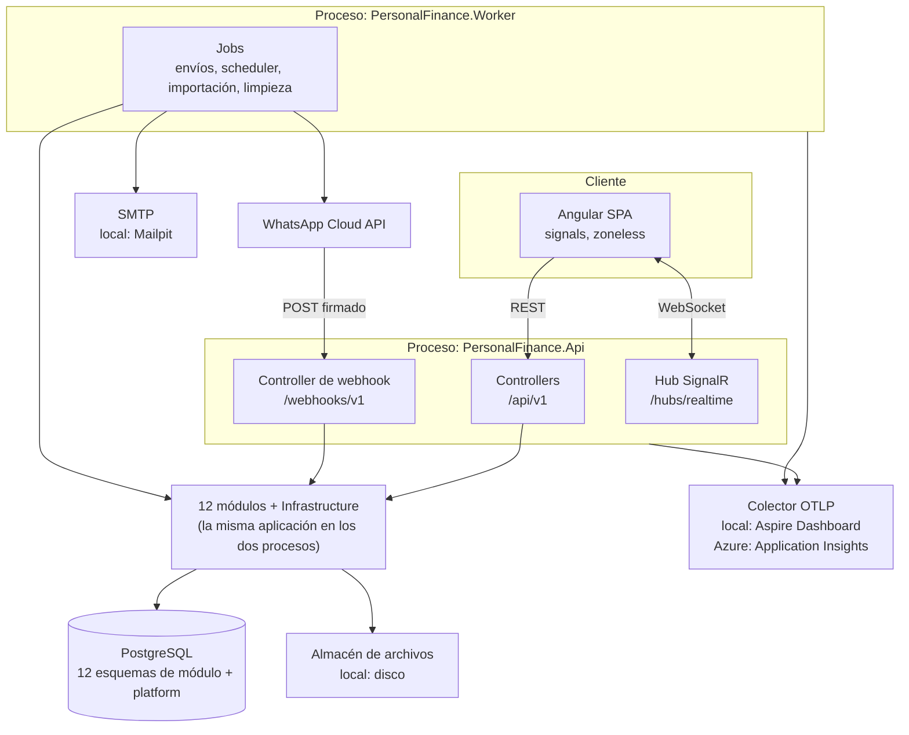

# Contenedores

```mermaid
flowchart TB
    subgraph Cliente
        SPA["Angular SPA<br/>signals, zoneless"]
    end
    subgraph Api["Proceso: PersonalFinance.Api"]
        HTTP["Controllers<br/>/api/v1"]
        HOOK["Controller de webhook<br/>/webhooks/v1"]
        HUB["Hub SignalR<br/>/hubs/realtime"]
    end
    subgraph Worker["Proceso: PersonalFinance.Worker"]
        JOBS["Jobs<br/>envíos, scheduler, importación, limpieza"]
    end
    MODS["12 módulos + Infrastructure<br/>(la misma aplicación en los dos procesos)"]
    DB[("PostgreSQL<br/>12 esquemas de módulo + platform")]
    OTEL["Colector OTLP<br/>local: Aspire Dashboard<br/>Azure: Application Insights"]
    SMTP["SMTP<br/>local: Mailpit"]
    META["WhatsApp Cloud API"]
    FS["Almacén de archivos<br/>local: disco"]

    SPA -->|"REST"| HTTP
    SPA <-->|"WebSocket"| HUB
    META -->|"POST firmado"| HOOK
    HTTP --> MODS
    HOOK --> MODS
    JOBS --> MODS
    MODS --> DB
    MODS --> FS
    JOBS --> SMTP
    JOBS --> META
    Api --> OTEL
    Worker --> OTEL
```

Los dos procesos solo se comunican a través de la base de datos: la API encola (envíos, sesiones de importación) y el Worker procesa.
