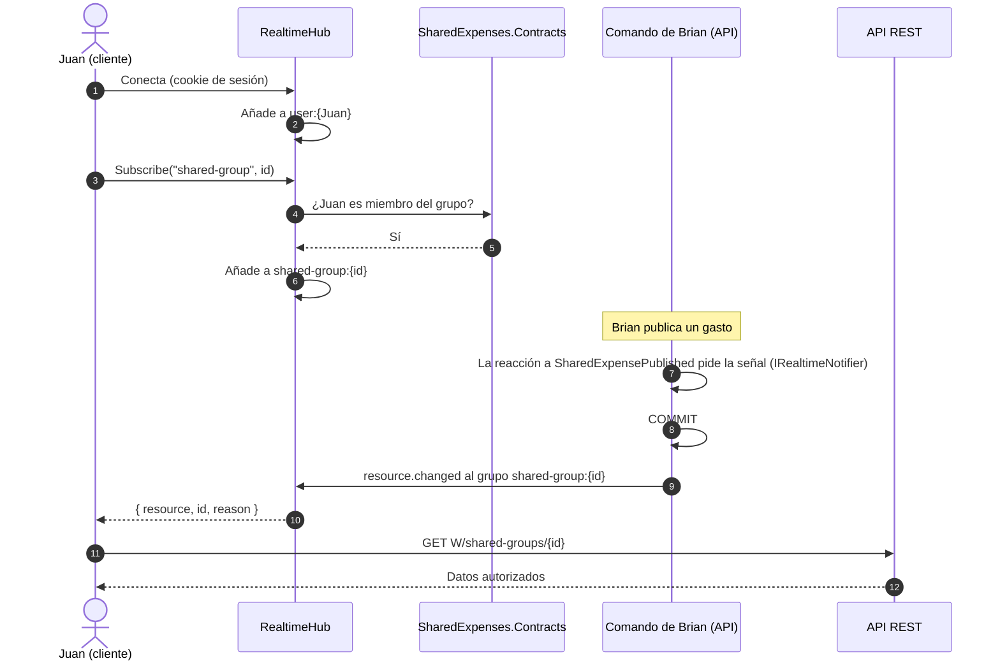

# Flujo de tiempo real

```mermaid
sequenceDiagram
    autonumber
    actor J as Juan (cliente)
    participant HUB as RealtimeHub
    participant SE as SharedExpenses.Contracts
    participant CMD as Comando de Brian (API)
    participant API as API REST

    J->>HUB: Conecta (cookie de sesión)
    HUB->>HUB: Añade a user:{Juan}
    J->>HUB: Subscribe("shared-group", id)
    HUB->>SE: ¿Juan es miembro del grupo?
    SE-->>HUB: Sí
    HUB->>HUB: Añade a shared-group:{id}
    Note over CMD: Brian publica un gasto
    CMD->>CMD: La reacción a SharedExpensePublished pide la señal (IRealtimeNotifier)
    CMD->>CMD: COMMIT
    CMD->>HUB: resource.changed al grupo shared-group:{id}
    HUB-->>J: { resource, id, reason }
    J->>API: GET W/shared-groups/{id}
    API-->>J: Datos autorizados
```

La señal se envía después del commit. Lo que crea un job del Worker no pasa por el hub: el cliente lo recoge con el sondeo de respaldo.
