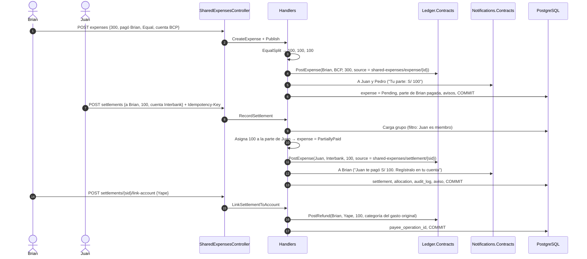

# Flujo de pago de un gasto compartido

```mermaid
sequenceDiagram
    autonumber
    actor B as Brian
    actor J as Juan
    participant API as SharedExpensesController
    participant H as Handlers
    participant LG as Ledger.Contracts
    participant NOT as Notifications.Contracts
    participant DB as PostgreSQL

    B->>API: POST expenses {300, pagó Brian, Equal, cuenta BCP}
    API->>H: CreateExpense + Publish
    H->>H: EqualSplit → 100, 100, 100
    H->>LG: PostExpense(Brian, BCP, 300, source = shared-expenses/expense/{id})
    H->>NOT: A Juan y Pedro ("Tu parte: S/ 100")
    H->>DB: expense = Pending, parte de Brian pagada, avisos, COMMIT

    J->>API: POST settlements {a Brian, 100, cuenta Interbank} + Idempotency-Key
    API->>H: RecordSettlement
    H->>DB: Carga grupo (filtro: Juan es miembro)
    H->>H: Asigna 100 a la parte de Juan → expense = PartiallyPaid
    H->>LG: PostExpense(Juan, Interbank, 100, source = shared-expenses/settlement/{sid})
    H->>NOT: A Brian ("Juan te pagó S/ 100. Regístralo en tu cuenta")
    H->>DB: settlement, allocation, audit_log, aviso, COMMIT

    B->>API: POST settlements/{sid}/link-account {Yape}
    API->>H: LinkSettlementToAccount
    H->>LG: PostRefund(Brian, Yape, 100, categoría del gasto original)
    H->>DB: payee_operation_id, COMMIT
```

Los avisos se escriben como reacción a `SharedExpensePublished` y `SettlementRecorded`, dentro de la misma transacción.
