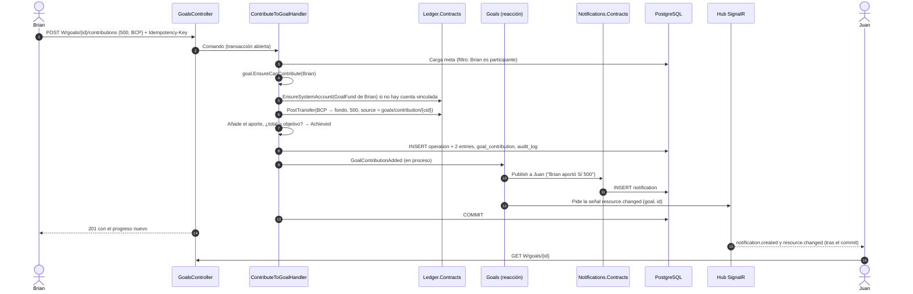

# Flujo de aporte a una meta compartida

```mermaid
sequenceDiagram
    autonumber
    actor B as Brian
    participant API as GoalsController
    participant H as ContributeToGoalHandler
    participant LG as Ledger.Contracts
    participant R as Goals (reacción)
    participant NOT as Notifications.Contracts
    participant DB as PostgreSQL
    participant RT as Hub SignalR
    actor J as Juan

    B->>API: POST W/goals/{id}/contributions {500, BCP} + Idempotency-Key
    API->>H: Comando (transacción abierta)
    H->>DB: Carga meta (filtro: Brian es participante)
    H->>H: goal.EnsureCanContribute(Brian)
    H->>LG: EnsureSystemAccount(GoalFund de Brian) si no hay cuenta vinculada
    H->>LG: PostTransfer(BCP → fondo, 500, source = goals/contribution/{cid})
    H->>H: Añade el aporte, ¿total ≥ objetivo? → Achieved
    H->>DB: INSERT operation + 2 entries, goal_contribution, audit_log
    H->>R: GoalContributionAdded (en proceso)
    R->>NOT: Publish a Juan ("Brian aportó S/ 500")
    NOT->>DB: INSERT notification
    R->>RT: Pide la señal resource.changed {goal, id}
    H->>DB: COMMIT
    API-->>B: 201 con el progreso nuevo
    RT-->>J: notification.created y resource.changed (tras el commit)
    J->>API: GET W/goals/{id}
```
