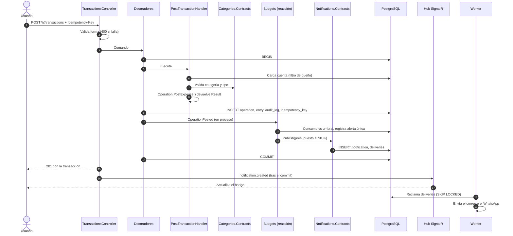

# Flujo de una transacción

```mermaid
sequenceDiagram
    autonumber
    actor U as Usuario
    participant API as TransactionsController
    participant DEC as Decoradores
    participant H as PostTransactionHandler
    participant CAT as Categories.Contracts
    participant BUD as Budgets (reacción)
    participant NOT as Notifications.Contracts
    participant DB as PostgreSQL
    participant RT as Hub SignalR
    participant W as Worker

    U->>API: POST W/transactions + Idempotency-Key
    API->>API: Valida forma (400 si falla)
    API->>DEC: Comando
    DEC->>DB: BEGIN
    DEC->>H: Ejecuta
    H->>DB: Carga cuenta (filtro de dueño)
    H->>CAT: Valida categoría y tipo
    H->>H: Operation.PostExpense() devuelve Result
    DEC->>DB: INSERT operation, entry, audit_log, idempotency_key
    DEC->>BUD: OperationPosted (en proceso)
    BUD->>DB: Consumo vs umbral, registra alerta única
    BUD->>NOT: Publish(presupuesto al 90 %)
    NOT->>DB: INSERT notification, deliveries
    DEC->>DB: COMMIT
    API-->>U: 201 con la transacción
    API->>RT: notification.created (tras el commit)
    RT-->>U: Actualiza el badge
    W->>DB: Reclama deliveries (SKIP LOCKED)
    W->>W: Envía el correo o el WhatsApp
```

Si la reacción de Budgets fallara, el paso 14 no ocurriría: el gasto tampoco se guardaría.
