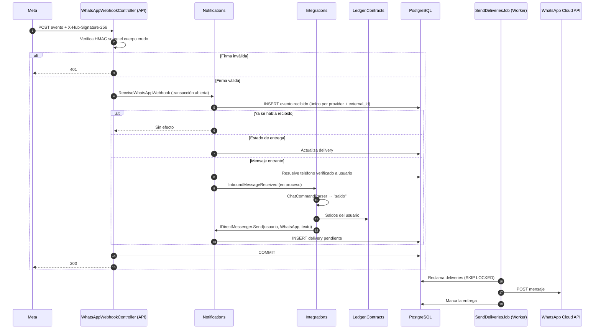

# Flujo de un webhook

```mermaid
sequenceDiagram
    autonumber
    participant M as Meta
    participant C as WhatsAppWebhookController (API)
    participant N as Notifications
    participant I as Integrations
    participant L as Ledger.Contracts
    participant DB as PostgreSQL
    participant J as SendDeliveriesJob (Worker)
    participant W as WhatsApp Cloud API

    M->>C: POST evento + X-Hub-Signature-256
    C->>C: Verifica HMAC sobre el cuerpo crudo
    alt Firma inválida
        C-->>M: 401
    else Firma válida
        C->>N: ReceiveWhatsAppWebhook (transacción abierta)
        N->>DB: INSERT evento recibido (único por provider + external_id)
        alt Ya se había recibido
            N-->>C: Sin efecto
        else Estado de entrega
            N->>DB: Actualiza delivery
        else Mensaje entrante
            N->>DB: Resuelve teléfono verificado a usuario
            N->>I: InboundMessageReceived (en proceso)
            I->>I: ChatCommandParser → "saldo"
            I->>L: Saldos del usuario
            I->>N: IDirectMessenger.Send(usuario, WhatsApp, texto)
            N->>DB: INSERT delivery pendiente
        end
        C->>DB: COMMIT
        C-->>M: 200
    end
    J->>DB: Reclama deliveries (SKIP LOCKED)
    J->>W: POST mensaje
    J->>DB: Marca la entrega
```

Si algo falla antes del commit se responde 500, no queda nada guardado y Meta reintenta.
