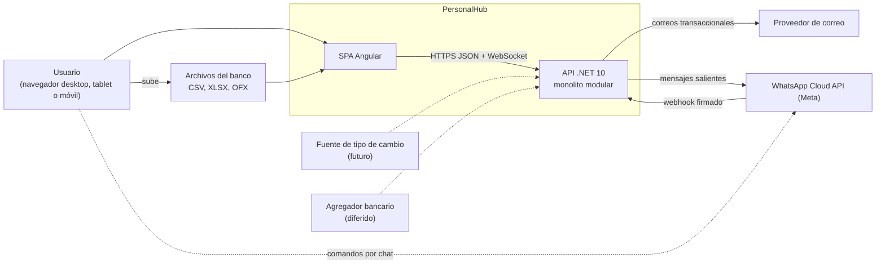

# Contexto del sistema

```mermaid
flowchart LR
    U["Usuario<br/>(navegador desktop, tablet o móvil)"]
    subgraph PH["PersonalHub"]
        WEB["SPA Angular"]
        API["API .NET 10<br/>monolito modular"]
    end
    MAIL["Proveedor de correo"]
    WA["WhatsApp Cloud API (Meta)"]
    FILES["Archivos del banco<br/>CSV, XLSX, OFX"]
    FX["Fuente de tipo de cambio<br/>(futuro)"]
    BANK["Agregador bancario<br/>(diferido)"]

    U --> WEB
    WEB -->|"HTTPS JSON + WebSocket"| API
    U -->|"sube"| FILES
    FILES --> WEB
    API -->|"correos transaccionales"| MAIL
    API -->|"mensajes salientes"| WA
    WA -->|"webhook firmado"| API
    U -.->|"comandos por chat"| WA
    FX -.-> API
    BANK -.-> API
```
